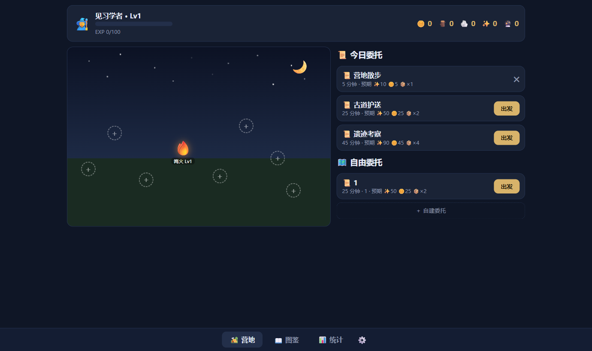

# 🏕️ 星夜营地(FightingToStudy)

让"主动学习"像游戏一样上瘾的本地网页应用:专注学习 = 出击委托,
归来结算经验、金币、材料与蛋;孵化生物伙伴、点亮图鉴、建造你的星夜营地。



## 为什么做这个

针对"动力系统四大故障",每个痛点都有对症的游戏机制:

| 痛点 | 机制 |
|------|------|
| 开始不了(拖延) | 打开即见 3 个就绪委托,一键出发;每天固定有 5 分钟超低门槛的「营地散步」;"差一次就孵出来了"的钩子 |
| 坚持不了(三分钟热度) | 不做惩罚性断签;等级/伙伴/营地资产永续;离开 3 天回来是"伙伴想你了"+回归礼包,负罪感变欢迎感 |
| 容易被干扰 | 全屏专注场景 + 伙伴陪伴;中途撤退 = 本次无掉落(但绝不扣已有资产) |
| 没成就感 | 四层反馈:数值(EXP/金币)→ 惊喜(随机掉落+稀有度光效)→ 收集(图鉴点亮)→ 空间(营地变繁荣) |

## 快速开始

需要 Node.js 20+。

```bash
npm install        # 首次
npm run build      # 打包前端
npm start          # 打开 http://localhost:3001
```

开发模式(前端热更新):`npm run dev`,访问 http://localhost:5173。

## 玩法

- **今日委托**:每天 3 个(5/25/45 分钟),也可自建委托(5~120 分钟,可贴学科标签)。
- **出击**:点「出发」进入全屏专注;刷新/误关页面自动恢复(计时真相在后端);中途撤退则本次无掉落。
- **结算**:经验、金币、材料必得;蛋概率掉落(连续 4 次不掉,第 5 次保底)。
- **孵化**:蛋按获得顺序排队孵化,每完成一次专注 +1 进度;24 种伙伴(寻常/稀有/史诗/传说)等你收集。
- **建造**:材料用于 7 种建筑(各 3 级),提供经验/金币/掉蛋/材料加成。
- **日夜**:界面随本地时间切换日/夜主题(6:00–18:00 日间),右下角 ⚙️ 可锁定主题、开关音效。

## 数值速查

| 项目 | 规则 |
|------|------|
| 经验 / 金币 | 分钟 ×2 / 分钟 ×1(×建筑加成) |
| 材料 | 必得 1 + ⌊分钟/15⌋ 个(工坊每级 +1) |
| 蛋概率 | min(15% + 分钟×0.2%, 35%) + 星象台/瞭望塔加成;4 连空必保底 |
| 稀有度 | 寻常 70 / 稀有 22 / 史诗 7 / 传说 1;孵化需专注 3/5/8/12 次 |
| 升级 | 升至下一级需 100 + (等级-1)×50 EXP,每 5 级解锁新称号 |

## 项目结构

```
client/   React 18 + Vite SPA(营地/冒险/图鉴/统计 四页,日夜主题,framer-motion 结算动画)
server/   Express 4 + better-sqlite3(结算纯函数 + 可注入时钟/种子RNG,内容配置 JSON 与存档分离)
data/     存档 app.db(启动时自动备份最近 3 份于 data/backups/,gitignored)
docs/     设计规格与实现计划(superpowers 工作流产出)
```

## 测试

```bash
npm test           # server(50)+ client(4)全部测试
```

## 路线图

- **v1.5**:Boss 战——大目标(如"啃完一本书")= 讨伐恶龙,设定总专注时长为血条,相关专注扣血,击败有大奖励。
- **v2**:AI 生成每日小剧情与随机事件、成就系统、营地装饰自由摆放、手机端优化、数据导出。
- **休闲玩法(构想池 · 待排期)**:
  - **抽卡 · 星夜转盘**:消耗金币/星尘转动转盘,概率获得材料、蛋或稀有伙伴;保留"就差一格"的张力,可做保底。
  - **赌一赌 · 篝火骰戏**:用金币(或当日多余材料)下注的小赌局,风险/回报对赌;克制设计——设每日上限、只赌身外之物,绝不碰经验/伙伴/已得资产。
  - **种地 · 营地农园**:可播种的地块,随真实时间或专注次数成长,到点收获材料/作物;把"等待与回访"变成新钩子。

设计细节见 [设计规格](docs/superpowers/specs/2026-06-11-fighting-to-study-design.md) 与 [实现计划](docs/superpowers/plans/2026-06-11-fighting-to-study.md)。
